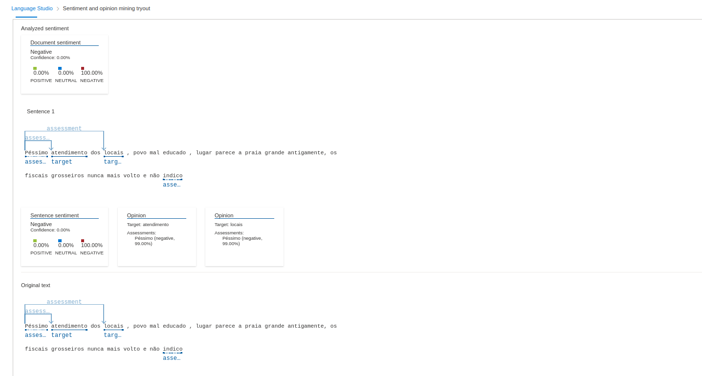
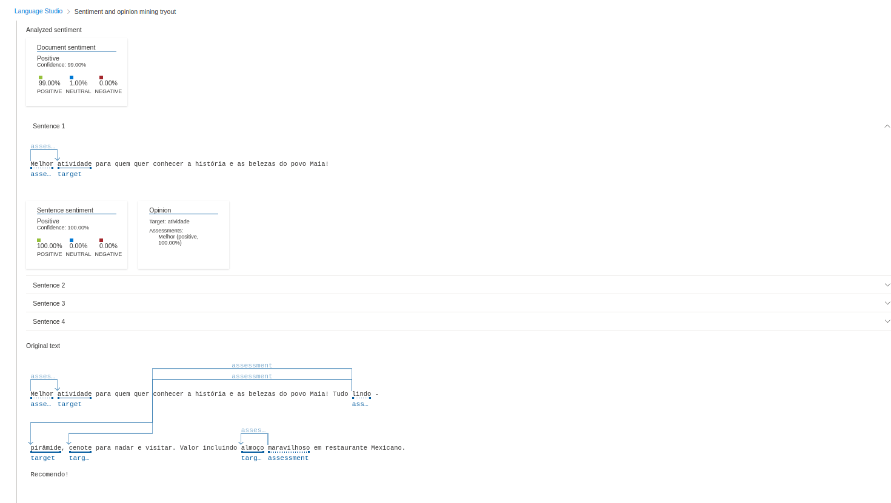
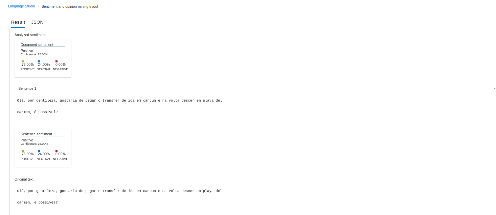
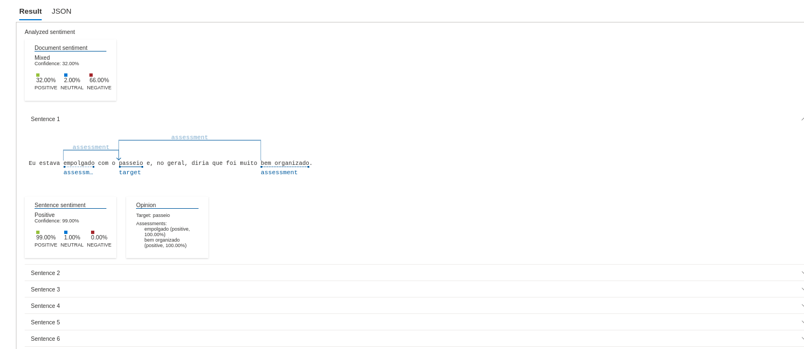
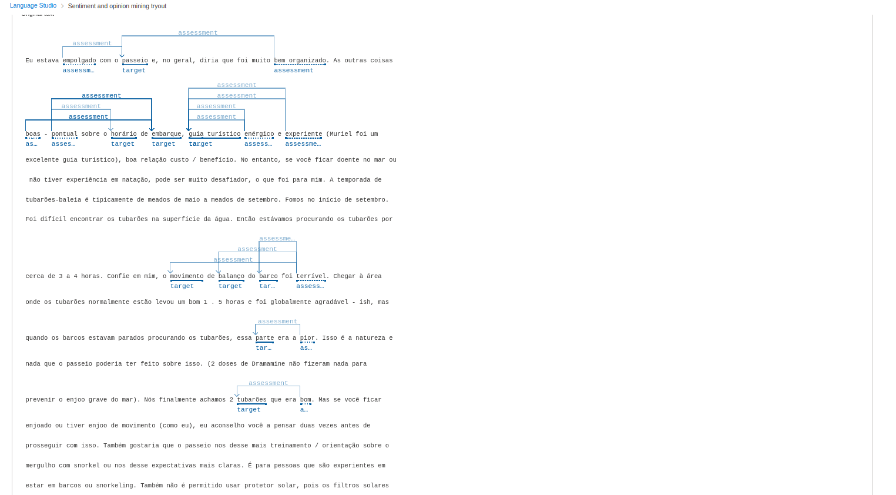

# Análise de sentimentos em textos com Language Studio n o Azure AI

## Outputs das avaliações, peguei as avaliações em sites de viagens e filtrei pelas estrelas e estar o quanto a IA reconhece/avalia

### A ia faz as análises em 4 sentenças por palavras chaves  ações. Com perguntas não há tanto teste

Output 1

Output 2

Output 3

Output 4

Este foi gerado 24 sentenças pelo texto ser grande, resumindo:

- A ia pegou sentenças com palavras negativas
- Muitos dos termos foram classificados como neutro
- Algumas vezes não há avaliação de trechos

