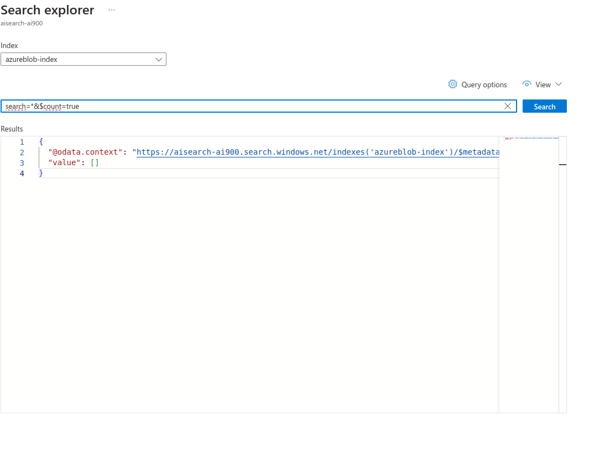
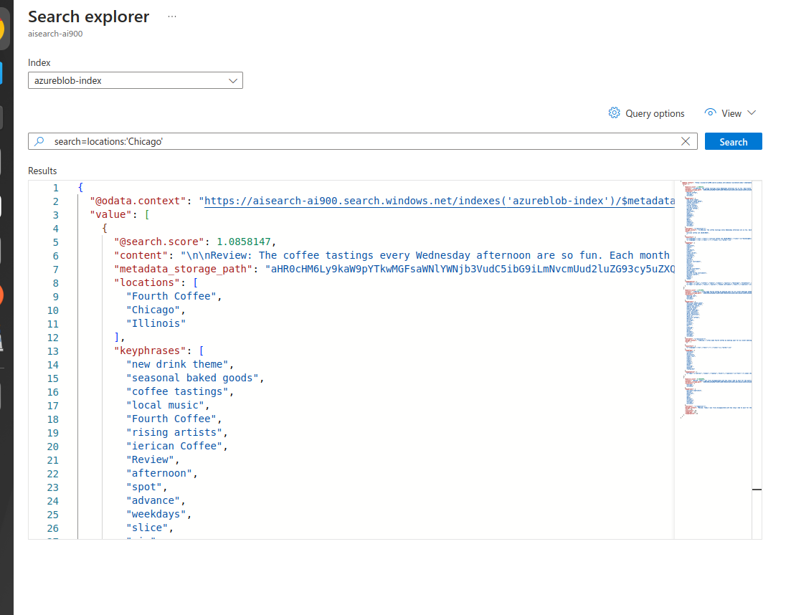
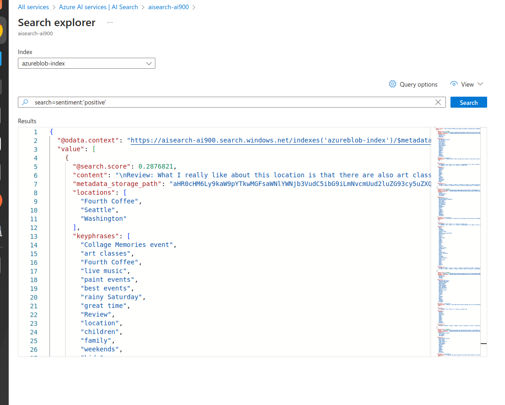

# Mineração de conhecimento

Encontrar insights(palavras chave) em escala.

Azure cognitive search é a plataforma para essa mineiração. Esse mecanismo é alimentado por IA.

Para  ingestão de dados usamos:

- Azure Blob Storage conteiners
- Azure Data Lake Storage Gen2
- Azure Table Storage

Enriquecimento da IA é alimentar ele com a quantidade máxima de dados possíveis para assim gerar os  melhores insights

- Entramos no [Portal](https://portal.azure.com/#home) do Azure
- Acesso o Azure AI Services
- Crio um novo recurso
- plano basic e sempre East uS no location, ppor questões de custos ser menor
- Criar novo recurso
- Teremos dois serviços: AI Search e AI Services
- vamos em Storage Account e criar nova
- Apenas primeira aba, dar nome, plano basic, redundância na primeira opção (LRS). review e create

No storage account fazemos armazenamentos de recursos

Para esse lab quebramos algumas seguranças (acesso anônimo). Ativamos o blob anonimo

- Vou em containers no menu esquerdo. Crio um novo
- Extraio os arquivos zipados de acordo com a documentação
- A documentação em [ai-search](https://aka.ms/ai900-ai-search)

Na documentação tem o passo a passo da criação deste campo e métodos de pesquisa
Posso averiguar se está ok:

Filtrar por localidade:

Por sentimentos nessas avaliações:

Criar um serviço e redirecionar a um repositório (meu storage)
Posso ter dados precisos de busca
