# Modelo de Previsão ML Azure

[] Criar um modelo de previsão com seus devidos pontos de extremidade configurados

[] Escreva o passo a passo desse processo em um readme.md de como você cheguei nessa etapa

[] Salvar nesse repositório o readme.md e o arquivo .json de pontos de extremidade

## Passo 1:

Acessei o [Azure](https://azure.microsoft.com) e criei a conta
Na página inicial procuro por Machine Learning:

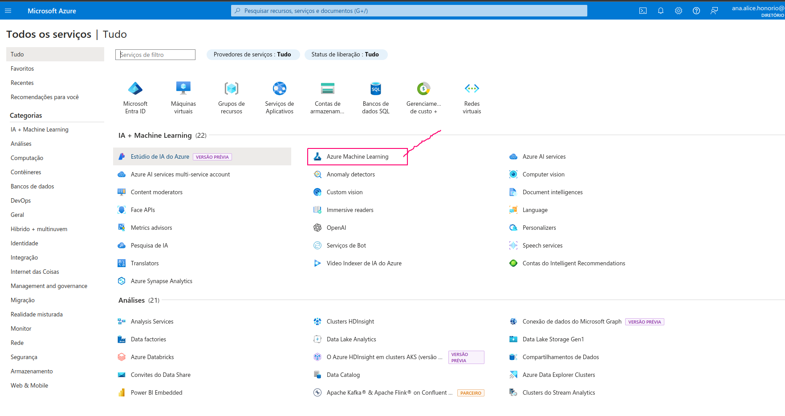

Vou em criar no menu esquerdo e clico em novo workspace


Vou para essa página

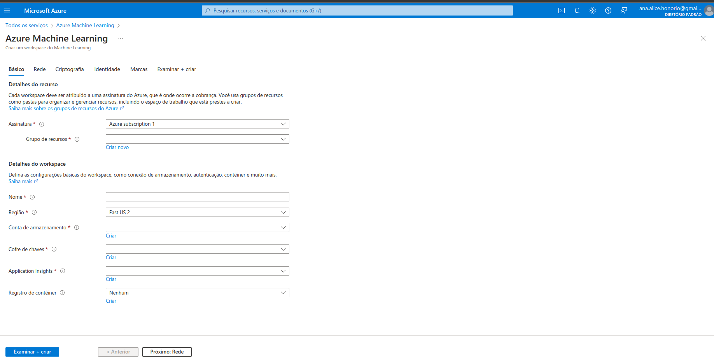

- Mantenho o nome
- Crio um novo grupo de recursos
- Dou umm  nome, região east us (são  mais baratos que no Brasil)
- Demais campos mantém
- Networking, ccriptografia, identidade..e demais campos não  mexo agora por ser um laboratório. Mas em um projeto real, a segurança em primeiro lugar!

Ao criar serei redirecionada a esta página. Me mantenho nela até que o status seja "Implantação foi concluída" e clico em "Ir para recurso"

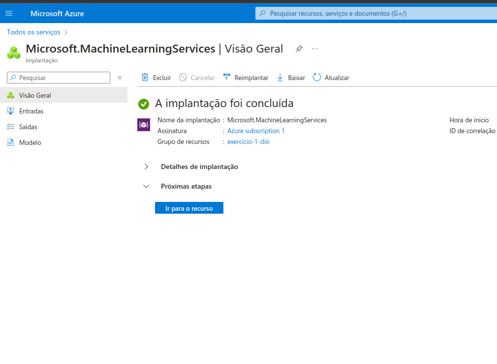

Clico em "Iniciar estudio"

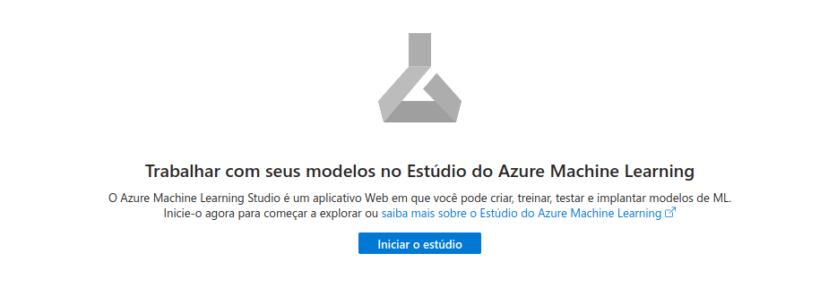

Vou para meus espaços. Caso não tiver, crio um novo

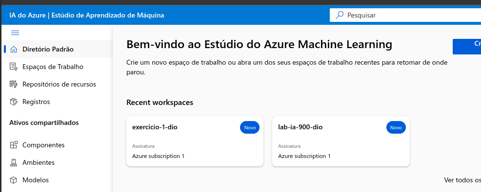

E irei sair nesta página inicial e na barra esquerda, clico em "ML Automatizado" e crio um novo

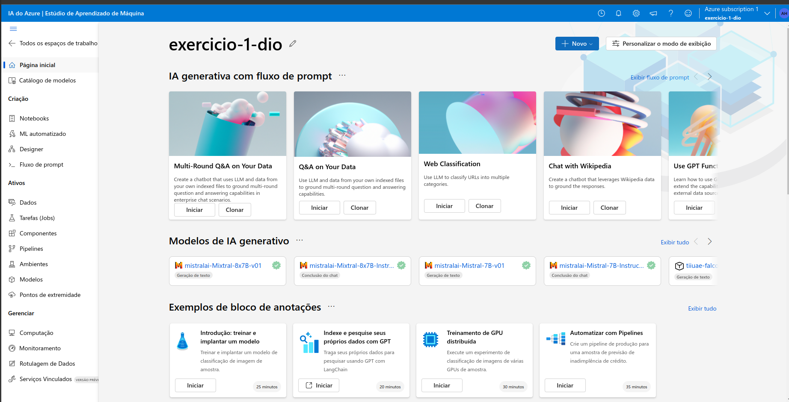

Vou preenchendo com os nomes, lendo a documentação do meu arquivo de dados da web com a url pública (mesma usada no exemplo prático da Dio)

```url

https://aka.ms/bike-rentals

```

Começo criar minha tabela. Ao clicar em "Criar", aguardo até a mensagem de "Êxito" aparacer

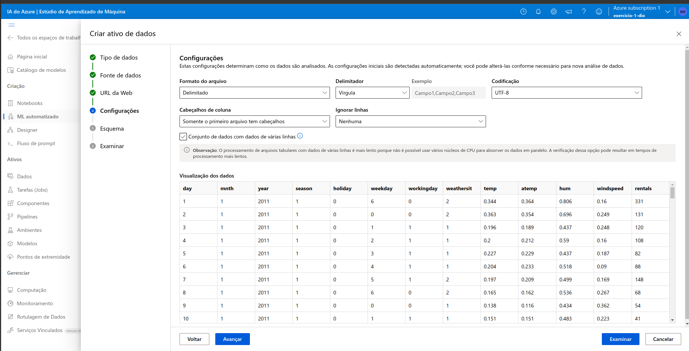

Configurações adicionais

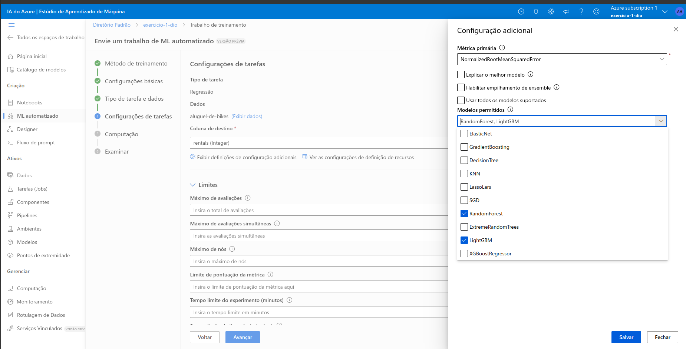

E próximas etapas:

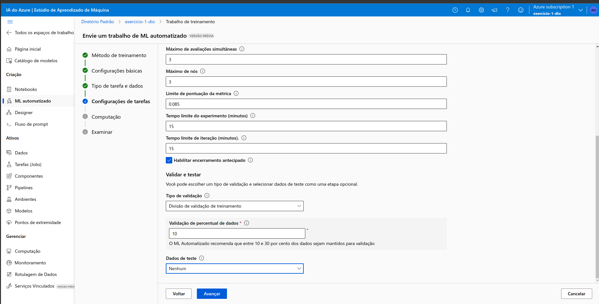
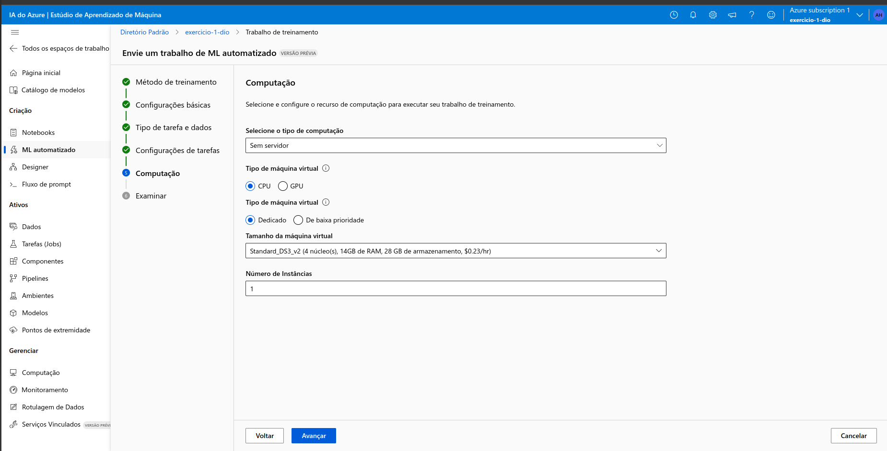
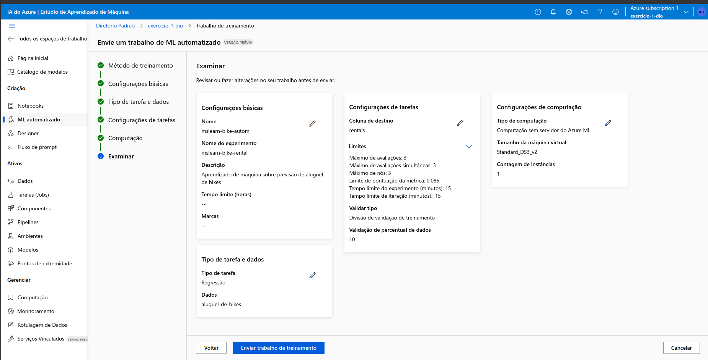

E aguardo...(aproveitar e buscar o cafézinho rs)

Vou em -> Menu lateral esquerdo -> "tarefas(jobs)" -> "+ Modelo de registro". Criando o modelo, vou no menu lateral em "Modelos".

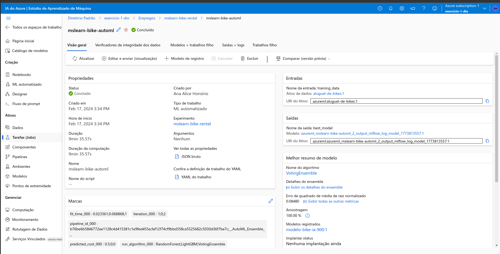

E entrando lá clico no link criado nesse modelo. Vou em "métricas"

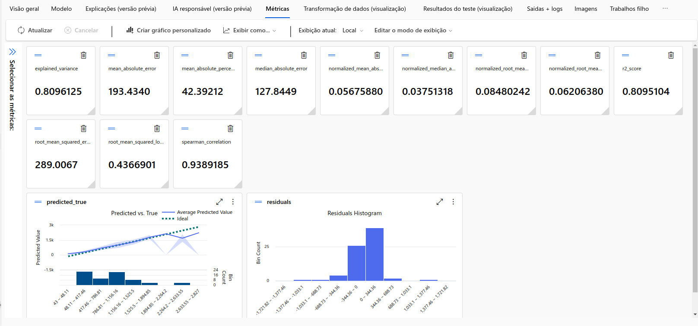

Para testar, no meu menu lateral, vou em "Pontos de extremidade"
Crio um  novo modelo e implanto. Espero até finalizar com estado do provisionamento ter dado ok.

Vou na aba testar

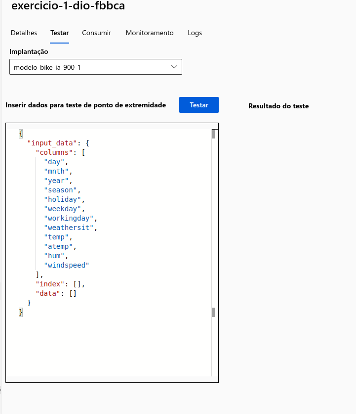

Adiciono os campos baseado na documentação(bike-rentals)
Tenho uma previsão de alugueis de bike

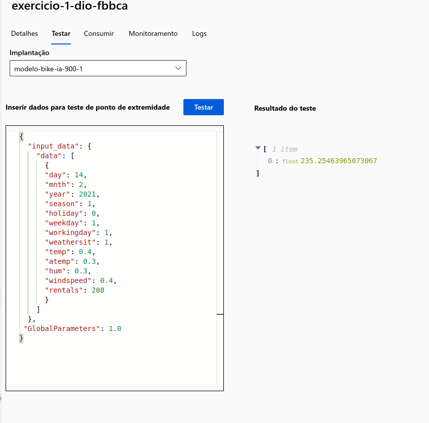

este é meu arquivo json testado

```json

{
  "input_data": {
    "data": [
      {
      "day": 14,
      "mnth": 2,
      "year": 2021,
      "season": 1,
      "holiday": 0,
      "weekday": 1,
      "workingday": 1,
      "weathersit": 1,
      "temp": 0.4,
      "atemp": 0.3,
      "hum": 0.3,
      "windspeed": 0.4,
      "rentals": 208 
      }
    ]
  },
 "GlobalParameters": 1.0
}

```