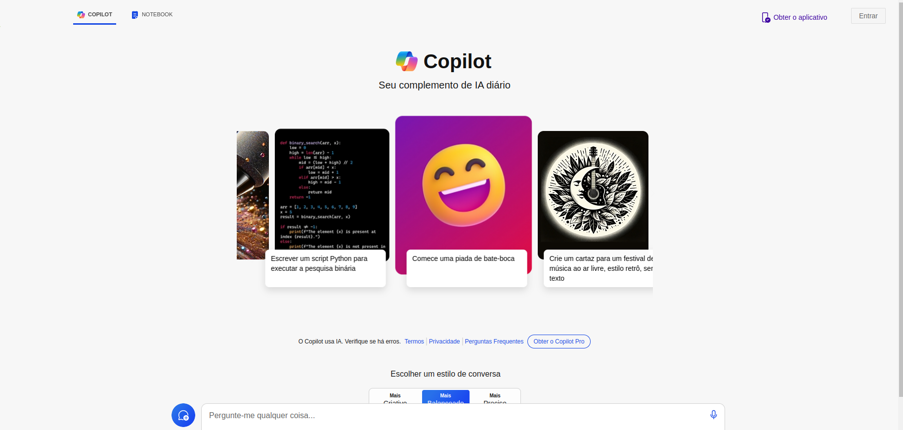
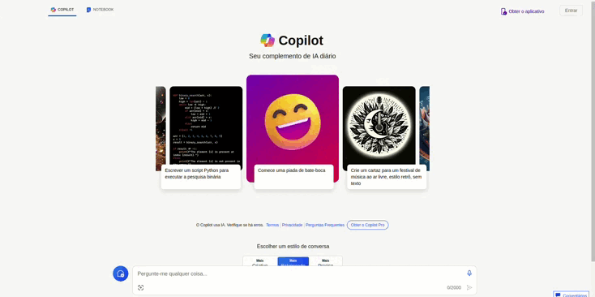
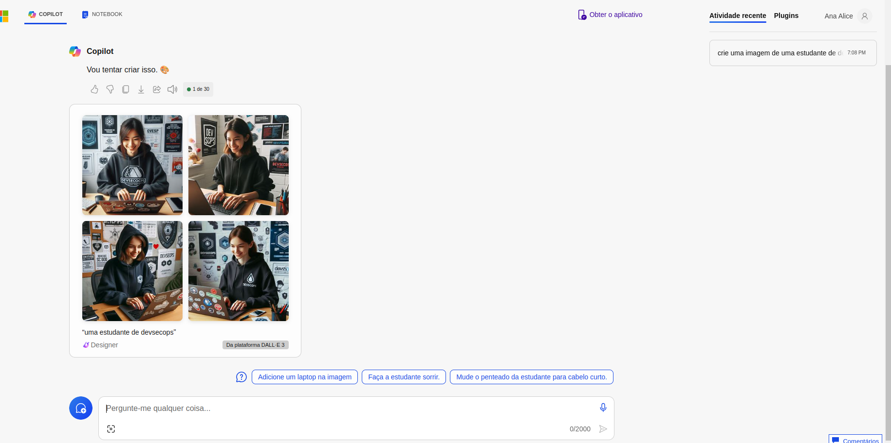

# Explorando os Recursos de IA Generativa com Copilot e OpenAI

Planejamento de uma IA generativa responsável: 

- Identificar
- Medida
- Mitigar
- Operar

Acessando o [Copilot](https://copilot.microsoft.com/)

Podemos inicialmente usar a caixa de perguntas para tirar dúvidas

Posso gerar imagens

## Com copilot há muitas possibilidades, podemos gerar códigos, imagens, textos, dúvidas. Infinitas possibilidades com IA generativa!
