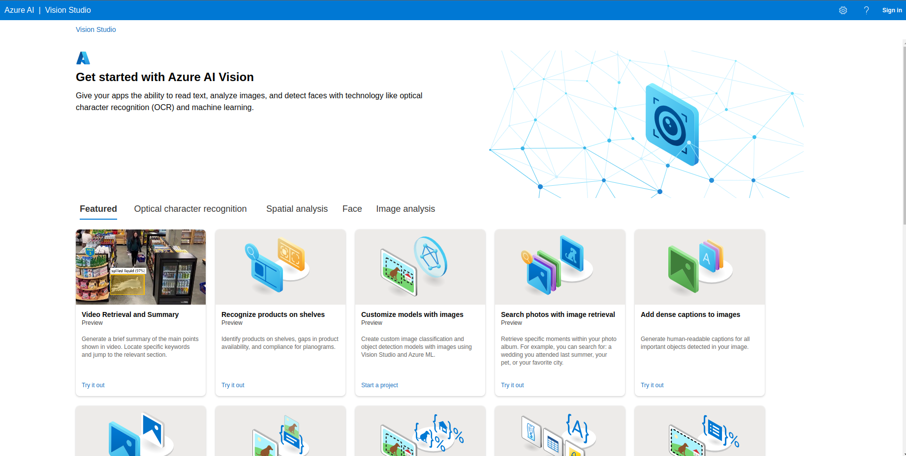
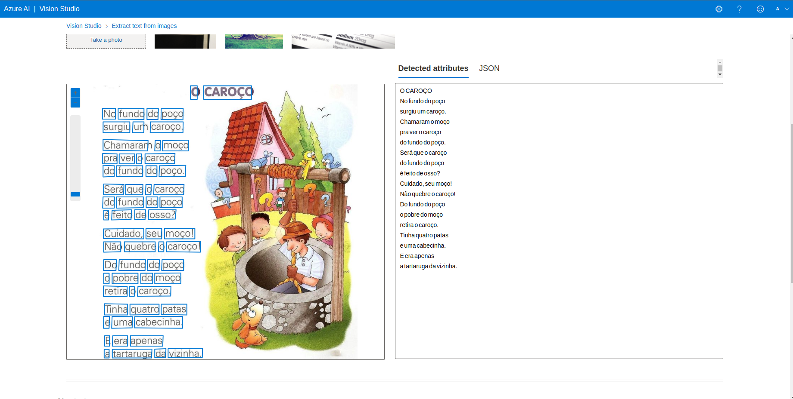
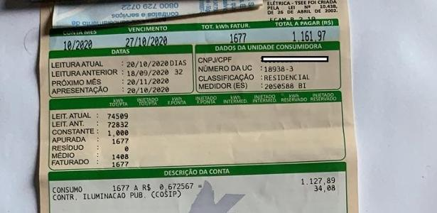
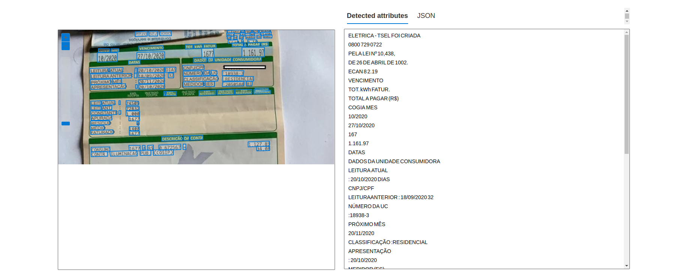
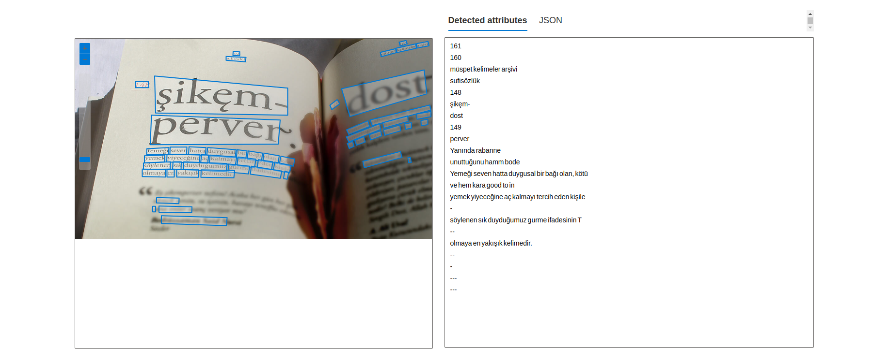
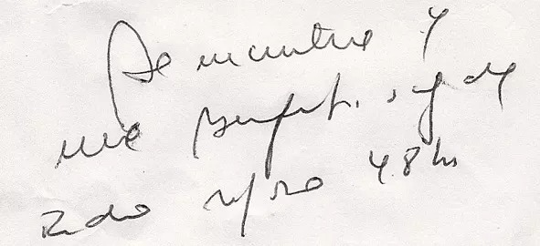
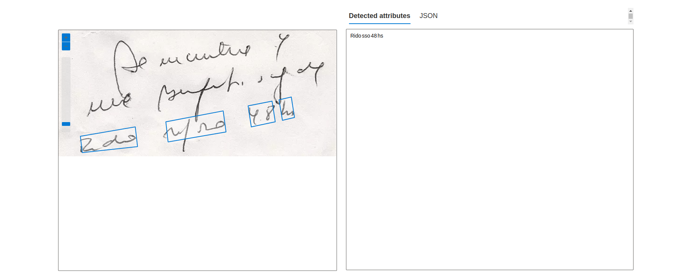
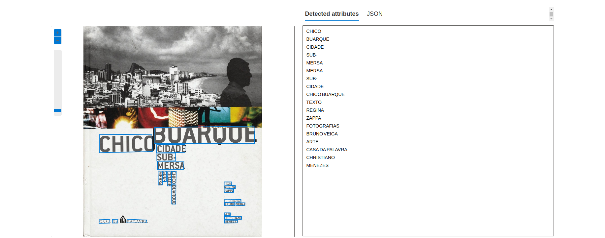

# Acessando o Azure Cognitive

Primeiro acessei a página principal -> Criar recurso -> ML + IA (menu esquerdo) -> Azure IA Services
Após criar conta fui para essa página do [Vision Cognitive](https://portal.vision.cognitive.azure.com/)

- Faço login -> Ver todos os recursos
- Face -> Detecção de faces em imagens

Input

Output

Input

Output

Input

Output

Input

Output

Input

Output

